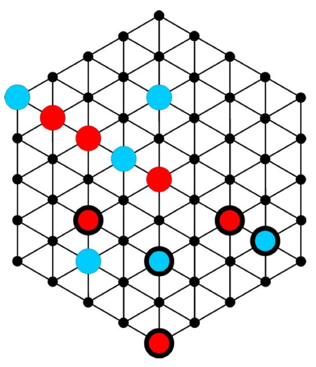
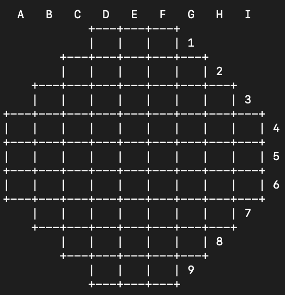
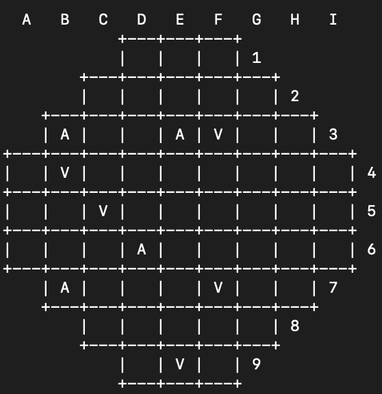
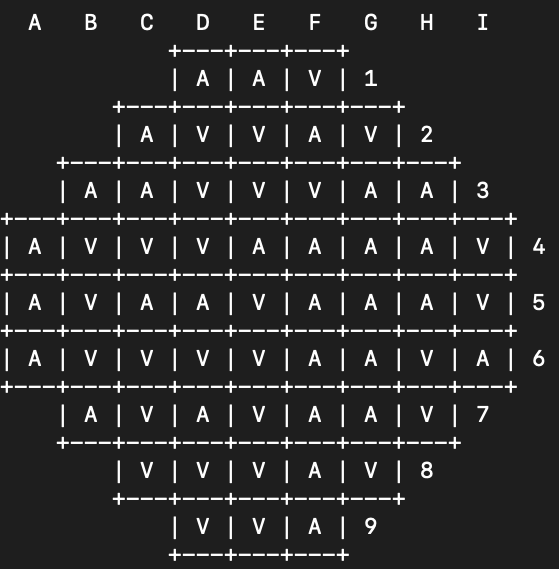

# Bide_2 PLOG 202/2021

Trabalho realizado pelos aluno da turma 1 e 2 (respetivamente) de PLOG: 
- Afonso Maria Rebordão Caiado de Sousa (up201806789)
- Vasco Marques Lopes Teixeira (up201802112)

# O Jogo: Bide

**Bide** é um jogo de estratégia combinatória para 2 a 6 jogadores (2 jogadores neste caso), jogado num tabuleiro hexagonal com grelha triangular, que está inicialmente vazia. O objetivo do jogo é fazer o **Grupo** com maior pontuação, ao criar “ondas de choque” aquando da colocação dos discos.

Um **Grupo** é uma coleção de todos os discos (adjacentes) conectados de uma só cor. Para obter a pontuação de um grupo, basta adicionar as pontuações de todos os seus discos.



### Equipamento para o jogo

- Tabuleiro Hexagonal com 57 casas
- 29 discos azuis (jogador 1)
- 29 discos verdes (jogador 2)

### Preparação

Selecionar a cor de cada jogador e pôr de parte então todos os discos de cada uma das cores. 
Decidir quem começa a jogar.

### Como Jogar

Cada jogador, no início do seu turno, escolhe um disco da sua cor. De seguida, este jogador tem de escolher 1 das seguintes 3 opções de jogada:

- **Bide**: Guardar o disco (e qualquer outro disco que já tenha sido guardado anteriormente)
- **Play**: Posicionar o disco numa casa vazia do tabuleiro.
- **Release**: Jogar todos os discos que tem na sua mão, de seguida. Esta jogada só pode ser efetuada se o jogador já tinha pelo menos um disco guardado anteriormente. Quando um jogador efetua esta jogada, o outro jogador tem de efetuar igualmente um **Release** na sua próxima jogada, incluindo o novo disco desse turno.

Quando um disco é posicionado no tabuleiro, cria uma “**shock wave**”. Isto significa que qualquer disco adjacente é movido de 1 casa na direção oposta ao posicionamento. 
No caso de existirem vários discos conectados adjacentes ao disco posicionado, posicionados diretamente na linha da “**shock wave**”, todos estes movem um espaço.
Se isto causar um disco tornar-se adjacente a um outro disco, este outro disco irá igualmente mover-se de um espaço (apenas conta se ficar adjacente na mesma linha da “**shock wave**”).
Por outro lado, discos não podem ser empurrados para fora do tabuleiro, ou seja qualquer linha cheia entre o novo disco posicionado e a borda, os discos não mexem.

### Final do Jogo

Quando o tabuleiro está cheio, os jogadores contam as pontuações.
Cada disco vale o número de pontos equivalente à sua distância da borda mais próxima (começando por zero). O jogador que tenha o **Grupo** com a pontuação mais elevada, ganha.
Em caso de empate, remover os discos posicionados mais perto das bordas, e recontar, até haver um vencedor. 


##### **source: https://nestorgames.com/#bide_detail**

# Representação do Estado de Jogo

### **Situação initial**: 
```
initial(Board):-
		nl, 
		Board = [[0,0,0],
			  [0,0,0,0,0],
			  [0,0,0,0,0,0,0],
			  [0,0,0,0,0,0,0,0,0],
			  [0,0,0,0,0,0,0,0,0],
			  [0,0,0,0,0,0,0,0,0],
			  [0,0,0,0,0,0,0],
			  [0,0,0,0,0],
			  [0,0,0]].
```



### **Situação intermédia**: 
```
intermediate_state(Board):-
		nl, 
		Board = [[0,0,0],
			  [0,0,0,0,0],
			  [1,0,0,2,2,0,0],
			  [0,2,0,0,0,0,0,0,0],
			  [0,0,1,0,0,0,0,0,0],
			  [0,0,0,2,0,0,0,0,0],
			  [1,0,0,0,1,0,0],
			  [0,0,0,0,0],
			  [0,2,0]].
```



### **Situação final**: 
```
final_state(Board):-
		nl, 
		Board = [[1,1,2],
			  [1,2,2,1,2],
			  [1,1,2,2,2,1,1],
			  [1,2,2,2,1,1,1,1,2],
			  [1,2,1,1,2,1,1,1,2],
			  [1,2,2,2,2,1,1,2,1],
			  [1,2,1,2,1,1,2],
			  [2,2,2,1,2],
			  [2,2,1]].
```



# Visualização do Tabuleiro

Para podermos visualizar o tabuleiro na consola, utilizamos o seguinte código:

```
dbDrawLine([X|Xs], Row) :-
   dbDrawHLine(Row),
   dbDrawCell(X),
   write(' '),
   write(Row),
   NextRow is Row + 1,
   nl,
   dbDrawLine(Xs, NextRow).
```

Este predicado, para cada linha, chama as funções responsáveis por desenhar as divisões das linhas e as próprias linhas e no fim de cada linha desenha o número correspondente: Incrementa o número da linha chamando-se novamente até todas estarem desenhadas.

```
dbDrawLine([],_) :-
   dbDrawLastHLine.

dbDrawLastHLine:-
   write('            +---+---+---+').
```

O predicado *dbDrawLine([],_)*, desenha uma última divisão do tabuleiro quando a última linha é desenhada.

```
dbDrawHLine(Row) :-
   (Row==4; Row==6; Row==5) -> write('+---+---+---+---+---+---+---+---+---+'),nl;
   (Row==7) -> write('+---+---+---+---+---+---+---+---+---+'),nl,write('    ');
   (Row==3) -> write('    +---+---+---+---+---+---+---+    '), nl, write('    ');
   (Row==8) -> write('    +---+---+---+---+---+---+---+    '), nl, write('        ');
   (Row==2) -> write('        +---+---+---+---+---+        '), nl, write('        ');
   (Row==9) -> write('        +---+---+---+---+---+        '), nl, write('            ');
   (Row==1) -> write('            +---+---+---+            '), nl, write('            ').
```

O predicado *dbDrawHLine(Row)*, desenha as divisões do tabuleiro e de cada linha do tabuleiro.

```
dbDrawCell([X|Xs]) :-
   write('|'),
   X==0 -> write('   '), dbDrawCell(Xs);
   X==1 -> write(' A '), dbDrawCell(Xs);
   X==2 -> write(' V '), dbDrawCell(Xs).
``` 

Este predicado desenha cada célula e a sua divisão, conteúdo muda dependendo se a casa estiver vazia ou com uma peça. 

```
dbDrawCell([]) :-
   write('|').
```

Desenha a última divisão de coluna de cada linha.