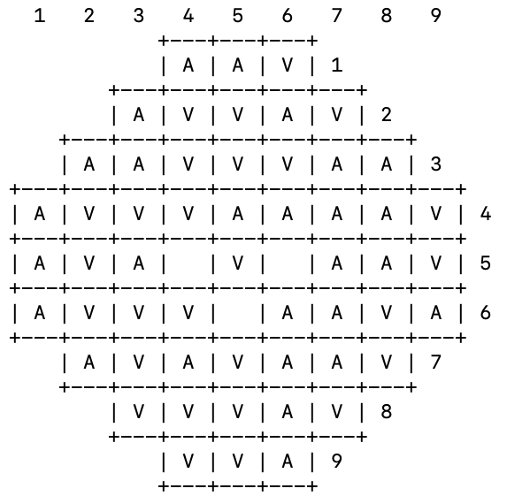

# PLOG 2020/2021 - TP1

# Grupo: Bide_2


Trabalho realizado pelos aluno da turma 2 e 1 (respetivamente) de PLOG: 
- Afonso Maria Rebordão Caiado de Sousa (up201806789)
- Vasco Marques Lopes Teixeira (up201802112)

# Instalação e Execução

Para jogar o nosso jogo, executar os seguintes passos:

- Previamente instalar SICStus Prolog;
- Correr o sicstus na diretória onde este foi instalado com ```$ ./sicstus``` ;
- ```$ consult('diretorio\ate\bide.pl').``` ;
- **Alternativa:** File > Working Directory e selecionar a pasta src descarregada. File > Consult e selecionar o ficheiro [bide.pl](https://github.com/afonsocaiado/PLOG-Bide2/blob/main/tp1/EntregaFinal/src/bide.pl);
- Escrever ```play.``` no SICStus e o jogo começa.

# O Jogo Bide

**Bide** é um jogo de estratégia combinatória para 2 a 6 jogadores (2 jogadores neste caso), jogado num tabuleiro hexagonal com grelha triangular, que está inicialmente vazia. O objetivo do jogo é fazer o **Grupo** com maior pontuação, ao criar “ondas de choque” aquando da colocação dos discos.

Um **Grupo** é uma coleção de todos os discos (adjacentes) conectados de uma só cor. Para obter a pontuação de um grupo, basta adicionar as pontuações de todos os seus discos.


### Equipamento para o jogo

- Tabuleiro Hexagonal com 57 casas
- 29 discos azuis (jogador 1)
- 29 discos verdes (jogador 2)

### Preparação

Selecionar a cor de cada jogador e pôr de parte então todos os discos de cada uma das cores. 
Decidir quem começa a jogar.

### Como Jogar

Cada jogador, no início do seu turno, escolhe um disco da sua cor. De seguida, este jogador tem de escolher 1 das seguintes 3 opções de jogada:

- **Bide**: Guardar o disco (e qualquer outro disco que já tenha sido guardado anteriormente)
- **Play**: Posicionar o disco numa casa vazia do tabuleiro.
- **Release**: Jogar todos os discos que tem na sua mão, de seguida. Esta jogada só pode ser efetuada se o jogador já tinha pelo menos um disco guardado anteriormente. Quando um jogador efetua esta jogada, o outro jogador tem de efetuar igualmente um **Release** na sua próxima jogada, incluindo o novo disco desse turno.

Quando um disco é posicionado no tabuleiro, cria uma “**shock wave**”. Isto significa que qualquer disco adjacente é movido de 1 casa na direção oposta ao posicionamento. 
No caso de existirem vários discos conectados adjacentes ao disco posicionado, posicionados diretamente na linha da “**shock wave**”, todos estes movem um espaço.
Se isto causar um disco tornar-se adjacente a um outro disco, este outro disco irá igualmente mover-se de um espaço (apenas conta se ficar adjacente na mesma linha da “**shock wave**”).
Por outro lado, discos não podem ser empurrados para fora do tabuleiro, ou seja qualquer linha cheia entre o novo disco posicionado e a borda, os discos não mexem.

### Final do Jogo

Quando o tabuleiro está cheio, os jogadores contam as pontuações.
Cada disco vale o número de pontos equivalente à sua distância da borda mais próxima (começando por zero). O jogador que tenha o **Grupo** com a pontuação mais elevada, ganha.
Em caso de empate, remover os discos posicionados mais perto das bordas, e recontar, até haver um vencedor. 


##### **source: https://nestorgames.com/#bide_detail**

# Lógica do Jogo

## **- Representação do Estado de Jogo**

### **Situação initial**: 
```
initial(Board):-
		nl, 
		Board = [[0,0,0],
			  [0,0,0,0,0],
			  [0,0,0,0,0,0,0],
			  [0,0,0,0,0,0,0,0,0],
			  [0,0,0,0,0,0,0,0,0],
			  [0,0,0,0,0,0,0,0,0],
			  [0,0,0,0,0,0,0],
			  [0,0,0,0,0],
			  [0,0,0]].
```


### **Situação intermédia**: 
```
intermediate_state(Board):-
		nl, 
		Board = [[0,0,0],
			  [0,0,0,0,0],
			  [1,0,0,2,2,0,0],
			  [0,2,0,0,0,0,0,0,0],
			  [0,0,1,0,0,0,0,0,0],
			  [0,0,0,2,0,0,0,0,0],
			  [1,0,0,0,1,0,0],
			  [0,0,0,0,0],
			  [0,2,0]].
```


### **Situação final**: 
```
final_state(Board):-
    Board = [[1,1,2],
            [1,2,2,1,2], 
         	[1,1,2,2,2,1,1],  
         	[1,2,2,2,1,1,1,1,2], 
         	[1,2,1,0,2,0,1,1,2],
            [1,2,2,2,0,1,1,2,1],
            [1,2,1,2,1,1,2],
            [2,2,2,1,2], 
            [2,2,1]],
            assert(playerPieces(blue,0)),
            assert(playerPieces(red,0)),
            assert(playerMaxPieces(blue,29)),
            assert(playerMaxPieces(red,29)).
```



## **- Visualização do Estado de Jogo**

### **Tabuleiro** - [board.pl](https://github.com/afonsocaiado/PLOG-Bide2/blob/main/tp1/EntregaFinal/src/board.pl)

Para podermos visualizar o tabuleiro na consola, utilizamos o seguinte código:

```
dbDrawLine([X|Xs], Row) :-
   dbDrawHLine(Row),
   dbDrawCell(X),
   write(' '),
   write(Row),
   NextRow is Row + 1,
   nl,
   dbDrawLine(Xs, NextRow).
```

Este predicado, para cada linha, chama as funções responsáveis por desenhar as divisões das linhas e as próprias linhas e no fim de cada linha desenha o número correspondente: Incrementa o número da linha chamando-se novamente até todas estarem desenhadas.

```
dbDrawLine([],_) :-
   dbDrawLastHLine.

dbDrawLastHLine:-
   write('            +---+---+---+').
```

O predicado *dbDrawLine([],_)*, desenha uma última divisão do tabuleiro quando a última linha é desenhada.

```
dbDrawHLine(Row) :-
   (Row==4; Row==6; Row==5) -> write('+---+---+---+---+---+---+---+---+---+'),nl;
   (Row==7) -> write('+---+---+---+---+---+---+---+---+---+'),nl,write('    ');
   (Row==3) -> write('    +---+---+---+---+---+---+---+    '), nl, write('    ');
   (Row==8) -> write('    +---+---+---+---+---+---+---+    '), nl, write('        ');
   (Row==2) -> write('        +---+---+---+---+---+        '), nl, write('        ');
   (Row==9) -> write('        +---+---+---+---+---+        '), nl, write('            ');
   (Row==1) -> write('            +---+---+---+            '), nl, write('            ').
```

O predicado *dbDrawHLine(Row)*, desenha as divisões do tabuleiro e de cada linha do tabuleiro.

```
dbDrawCell([X|Xs]) :-
   write('|'),
   X==0 -> write('   '), dbDrawCell(Xs);
   X==1 -> write(' A '), dbDrawCell(Xs);
   X==2 -> write(' V '), dbDrawCell(Xs).
``` 

Este predicado desenha cada célula e a sua divisão, conteúdo muda dependendo se a casa estiver vazia ou com uma peça. 

```
dbDrawCell([]) :-
   write('|').
```

Desenha a última divisão de coluna de cada linha.

### **Menus** - [menu.pl](https://github.com/afonsocaiado/PLOG-Bide2/blob/main/tp1/EntregaFinal/src/menu.pl)


Para efetuar a apresentação do menu principal, temos o predicado ```mainMenu```, que chama todas os restantes predicados que são precisos, da seguinte forma:

```
mainMenu :-
    printMain,
    getOption,
    read(Input),
    optionChosen(Input).
```

- O predicado ```printMain``` trata de escrever na consola a apresentação geral do nosso menu de jogo.
- ```getOption``` pede ao utilizador para fazer input da opção do menu que pretende escolher.
-  O predicado ```optionChosen``` efetua o tratamento do input vindo do utilizador, redirecionando o jogador para o que este deseja.

## **- Jogadas Válidas** - [game.pl](https://github.com/afonsocaiado/PLOG-Bide2/blob/main/tp1/EntregaFinal/src/game.pl)

Para obter a lista de possíveis jogadas dado o estado atual do tabuleiro, implementamos o predicado ```valid_moves(Board,MovesList)```. Este predicado retorna em MovesList uma lista de jogadas válidas que o CPU pode efetuar, sob a forma ```X-Y```, tendo em conta o atual ```Board```.

Este último predicado faz uso do predicado ```valid_move(X,Y,Board)```, predicado este que dado um par ```X-Y```, verifica se esta posição está disponivel no tabuleiro atual de jogo. Este predicado é também utilizando quando um utilizador faz input da posição onde deseja colocar a sua peça.

Para a posição estar disponível e o predicado suceder, primeiro verificamos se essa mesma posição é efetivamente uma posição existente no tabuleiro base, com o predicado ```inside_board(X,Y)``` e, de seguida, verificamos se essa posição não estará já ocupada por outra peça, com ```pos_is_empty(Board,X,Y,E)```. Este predicado sucede se para o ```Board``` atual a posição ```X-Y``` estiver vazia.

## **- Execução de Jogadas** - [game.pl](https://github.com/afonsocaiado/PLOG-Bide2/blob/main/tp1/EntregaFinal/src/game.pl)

Para um jogador ser capaz de efetuar uma jogada normal, implementamos o predicado ```move(Side,Board,NewBoard,X,Y)```, da seguinta forma:

```
move(Side,Board,NewBoard,X,Y):-
    place_piece(Side,Board,Board2,X,Y),
    value_of_y_based_on_x(X,Y,Y1),
    find_adjacent_cells(Board2, X, Y1, ListAdjX, ListAdjY),
    move_adjacent_cells(Board2, X, Y, ListAdjX, ListAdjY, NewBoard).
```
O predicado ```place_piece(Side,Board,NewBoard,X,Y)``` é responsável por colocar a peça ```X-Y``` no respetivo local ao adicionar esta nova peça a uma lista de peças presentes no tabuleiro atual, para depois chamar o predicado ```replace_list_in_board``` que atualiza essa mesma lista do tabuleiro.

No Bide, quando uma nova peça é posicionada no tabuleiro, as peças adjacentes a esta devem ser reposicionadas (quando possível). Para tal, implementamos os dois predicados ```find_adjacent_cells(Board, X, Y, ListAdjX, ListAdjY)``` e ```move_adjacent_cells(Board, X, Y, ListAdjX, ListAdjY, NewBoard)```. Como o nomes indica, o primeiro predicado é responsável por criar duas listas ```ListAdjX```e ```ListAdjY``` que contêm uma lista das coordenadas de todas as peças presentes em ```Board``` que são adjacentes à nova peça posicionada em ```X-Y```. Por outro lado, ```move_adjacent_cells```, obtendo estas novas listas de peças adjacentes, ocupa-se em movimentá-las todas para as suas novas posições, com a ajuda do predicado ```knockback_move(Board, X, Y,[HeadAdjX|TailAdjX], [HeadAdjY|TailAdjY], NewBoard)```.

Como viste anteriormente, no Bide é tambem possível efetuar jogadas **release** e jogadas **bide**. 
Quando o jogador efetua um **bide**, o predicado ```player_bide(Side, Pieces)``` acrescenta 1 ao numero de peças existentes (```playerPieces```) para o jogador ```Side```.
Quando o jogador efetua um **release**, o predicado ```player_release(Side, Pieces, Board, NewBoard)``` implementa recursividade para posicionar todas as peças ```Pieces``` que este jogador tem disponíveis, naturalmente, utilizando o predicado anteriormente descrito, ```move(Side,Board,NewBoard,X,Y)```.

## **- Final do Jogo** - [game.pl](https://github.com/afonsocaiado/PLOG-Bide2/blob/main/tp1/EntregaFinal/src/game.pl)

Para verificar se o jogo terminou, utilizamos o predicado ```game_over(Board, GO)``` que itera o tabuleiro ```Board```. se após iterar o tabuleiro atual, chegar à conclusão que todas as posições estão ocupadas, ou seja, que o jogo terminou, o parametro ```GO``` toma o valor 1, 0 se não for o caso. 
Quando ```GO``` é 1, é chamado o predicado ```announceResult(Score)``` que dado um ```Score``` anteriormente obtido com o predicado ```value(Board, ScoreBoard, NewScore)``` (```NewScore```). É então anunciado o vencedor e a diferença de pontos pela que este venceu. Finalmente, após declarar o vencedor da partida, o jogo retorna ao Menu Principal ```mainMenu``.
Quando ```GO```é 0, o jogo continua, pois ainda há posições vazias.

## **- Avaliação do Tabuleiro** - [game.pl](https://github.com/afonsocaiado/PLOG-Bide2/blob/main/tp1/EntregaFinal/src/game.pl)

Para avaliar o atual estado do jogo, a cada jogada, no predicado principal ```game/4```, é chamado um predicado ```value(Board, ScoreBoard, NewScore)``` que, tendo em conta ```ScoreBoard``` (lista de listas com a pontuação de cada posição do tabuleiro) e o estado atual da ```Board```, retorna em ```NewScore``` a pontuação com que ficaria o jogador que acabou de efetuar a sua jogada, se o jogo terminasse nesse momento.

## **- Jogada do Computador** - [game.pl](https://github.com/afonsocaiado/PLOG-Bide2/blob/main/tp1/EntregaFinal/src/game.pl)

O principal predicado responsável pela escolha da jogada a efetuar pelo computador é o predicado ```cpuMove/5```, implementado da seguinte forma:

```
cpuMove(Side,Board, NewBoard, ReleaseTag, ReleaseTag1):-
    score_board(ScoreBoard),
    valid_moves(Board, MovesList),
    best_move(MovesList, ScoreBoard, X, Y, _),
    move(Side,Board,NewBoard,X,Y).
```

Este predicado faz uso de vários predicados anteriormente descritos, tais como ```valid_moves/2``` e ```move/5```. Em adição, é utilizado o predicado ```score_board/1``` que tem em ```ScoreBoard``` uma lista de listas com a pontuação de cada posição do tabuleiro.

O predicado ```best_move([X-Y|T], ScoreBoard, Xf,Yf, Max)```, graças a ```getCellScore(X,Y,ScoreBoard,Value)``` obtém a pontuação de uma posição ```X-Y```. Ao percorrer ```MovesList``` (lista com todas as possiveis jogadas, obtida com o predicado ```valid_moves/2```), o predicado ```best_move``` vai atualizando a pontuação máxima que o computador pode atingir se posicionar a peça numa certa posição. De seguida, após terminar de percorer a lista, atribui as coordenadas da posição de pontuação mais elevada disponível aos parâmetros X e Y do predicado.

Finalmente, o computador posiciona a peça na posição obtida, com ```move/5``` como visto. 

# Conclusões

À partida, sendo prolog uma liguagem nova e sobretudo diferente, o começo do trabalho contou com algumas dúvidas e dificuldades. Mas, à medida que nos acostumamos à linguagem, o conhecimento sobre esta última não parou de crescer com a implementação do trabalho, e conseguimos assim avançar rapidamente com o nosso jogo.

Acreditamos não encontrar erros ou bugs na nossa implementação e no nosso jogo, mas estamos abertos a sugestões!

Por outro lado, em relação a possíveis melhoramentos, poderíamos eventualmente acrescenter diferentes dificuldades / níveis para os jogos contra o computador. Não só considerando a pontuação da posição onde vai colocar a peça, mas tendo também em consideração a pontuação para onde vão ser deslocadas as peças adjacentes.

# Bibliografia

- Slides disponíveis no moodle;
- [Nestor Games](https://nestorgames.com/#bide_detail)
- [Documentação SICTUS](https://sicstus.sics.se/sicstus/docs/latest4/html/sicstus.html/)
- [Documentação SWI](https://www.swi-prolog.org/pldoc/doc_for?object=manual)